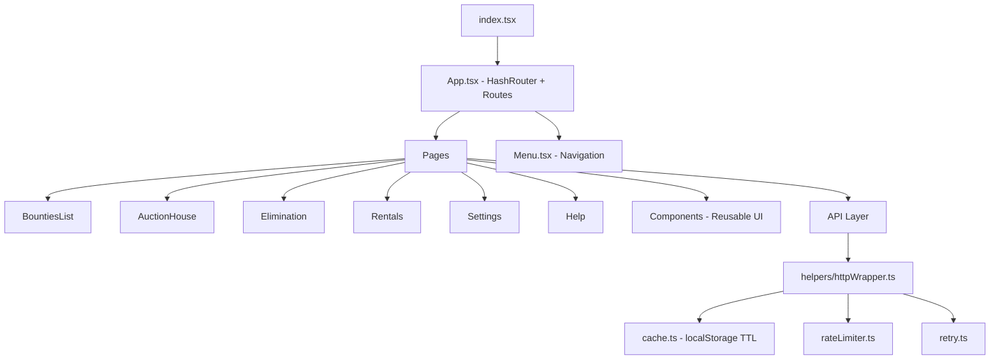
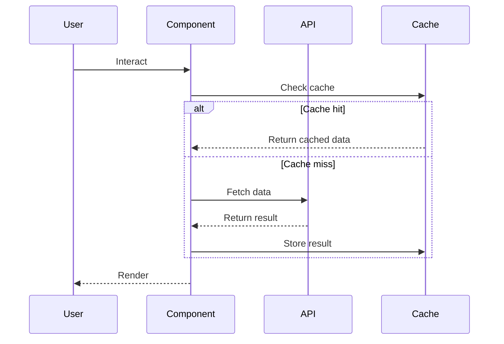

# Contribution Guide (Agents & Humans)

## Project Overview

Torn Pages is a React + TypeScript web app that provides tools for the game [Torn](https://www.torn.com/) — bounty tracking, auction house, elimination tournaments, and property rentals. It uses Create React App, React Router (HashRouter), and localStorage-based caching.

## Quick Reference

| Area | Detail |
|---|---|
| Framework | React 19 + TypeScript |
| Router | react-router-dom 7 (HashRouter) |
| Build | `npm start` / `npm run build` / `npm test` |
| Notifications | react-toastify |
| State | React hooks only (no Redux/Zustand) |
| CSS | Separate `.css` files per component, kebab-case class names |
| Tests | Jest + React Testing Library |

## Architecture



## Directory Structure

```
src/
├── api/              # API modules and shared helpers
│   ├── helpers/      # cache, httpWrapper, rateLimiter, retry
│   ├── bounty/       # Torn bounties API
│   ├── elimination/  # Elimination tournament API
│   ├── ffscouter/    # Fair Fight scouting API
│   ├── market/       # Auction house API
│   ├── properties/   # Property/rental API
│   ├── user/         # User profile API
│   └── index.ts      # Barrel exports
├── components/       # Reusable UI components
│   ├── auction/      # Auction-specific components
│   ├── elimination/  # Elimination-specific components
│   ├── property/     # Property-specific components
│   └── index.ts      # Barrel exports
├── hooks/            # Custom React hooks
├── pages/            # Route-level page components
├── App.tsx           # Root component with routing
├── Menu.tsx          # Navigation menu
└── index.tsx         # Entry point
```

## Development Principles

### 1. Small, Focused Components

Split features into small, single-responsibility components. A page should compose multiple smaller components, not contain all logic inline.

**Do:**
```
AuctionHouse.tsx (page - composes components)
├── AuctionFilter.tsx (filter controls)
├── AuctionTable.tsx (data table)
└── AuctionTableRow.tsx (single row)
```

**Don't:** Put 300+ lines of mixed filter logic, table rendering, and data fetching into one component.

### 2. CSS in Separate Files

Always put CSS in a separate `.css` file alongside the component. Use kebab-case class names prefixed with the component name to avoid collisions.

```
components/
├── MyWidget.tsx
├── MyWidget.css
└── MyWidget.test.tsx
```

Class naming: `.my-widget-container`, `.my-widget-header`, `.my-widget-item`

Do NOT use inline styles except for truly dynamic values (e.g. calculated widths).

### 3. Reuse Before Reinventing

Before creating new UI, check existing reusable components:

| Component | Location | Purpose |
|---|---|---|
| `Button` | `components/Button.tsx` | Standard button with onClick/disabled |
| `PasswordInput` | `components/PasswordInput.tsx` | API key input with show/hide/clear |
| `FormattedNumber` | `components/FormattedNumber.tsx` | Number display formatting |
| `TimeRemaining` | `components/TimeRemaining.tsx` | Countdown / time display |
| `FfApiKeyTestButton` | `components/FfApiKeyTestButton.tsx` | API key validation button |

Also check `src/components/index.ts` for the full list of exports.

### 4. Ask Questions When Uncertain

If requirements are ambiguous, ask the user before implementing. Specifically ask about:
- Where a new feature should live in the routing structure
- Whether to extend an existing component or create a new one
- Expected behavior for edge cases (empty states, errors, loading)
- Design preferences when multiple valid approaches exist

### 5. Feature Documentation with Diagrams

When adding a new feature, include a mermaid diagram in the PR description or feature docs showing the component/data flow:



## Coding Conventions

### Component Pattern

```typescript
import React from 'react';
import './MyComponent.css';

interface MyComponentProps {
  title: string;
  onAction?: () => void;
}

const MyComponent: React.FC<MyComponentProps> = ({ title, onAction }) => {
  return (
    <div className="my-component">
      <h2 className="my-component-title">{title}</h2>
      {onAction && <Button onClick={onAction}>Go</Button>}
    </div>
  );
};

export default MyComponent;
```

### API Pattern

All API functions return `{ data: T | null, error: string | null }`. **All API calls must be wrapped in `httpWrapper`** (`src/api/helpers/httpWrapper.ts`) for caching, rate limiting, and retries. Never use raw `fetch()` for Torn API calls.

```typescript
import { httpWrapper } from '../helpers/httpWrapper';
import { Cache } from '../helpers/cache';

const cache = new Cache<Thing>({ storageKey: 'thing-cache', maxStalenessMs: 3_600_000 });

export async function fetchThing(apiKey: string): Promise<DataOrError<Thing>> {
  return httpWrapper<Thing>(
    { cache, retry: { maxRetries: 2, isSuccess: (r) => r.error === null } },
    async () => {
      const response = await fetch(`https://api.torn.com/...?key=${apiKey}`);
      const data = await response.json();
      if ('error' in data && data.error) {
        return { data: null, error: `Torn API Error: ${data.error.error}` };
      }
      return { data: data as Thing, error: null };
    }
  );
}
```

### Hooks

Custom hooks live in `src/hooks/` and follow the `useXxx` convention. See `usePassword.ts` for the existing pattern.

### Exports

Add new components to `src/components/index.ts` and new API functions to `src/api/index.ts` via barrel exports.

### Testing

Write tests alongside components: `MyComponent.test.tsx` next to `MyComponent.tsx`. Use React Testing Library — query by role/label, not implementation details.

## Adding a New Feature — Checklist

1. **Explore** existing components and API modules for reuse opportunities
2. **Ask** the user about ambiguous requirements before coding
3. **Plan** the component breakdown — aim for small, composable pieces
4. **Create** components with separate `.css` files
5. **Wire up** routing in `App.tsx` if it's a new page
6. **Add** menu entry in `Menu.tsx` if it's a new page
7. **Export** new components from `src/components/index.ts`
8. **Test** with `npm test`
9. **Document** with a mermaid diagram showing component/data flow

## Common Commands

```bash
npm start     # Dev server on localhost:3000
npm test      # Run tests (watch mode)
npm run build # Production build
```
