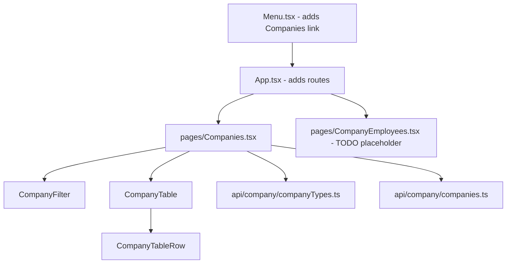
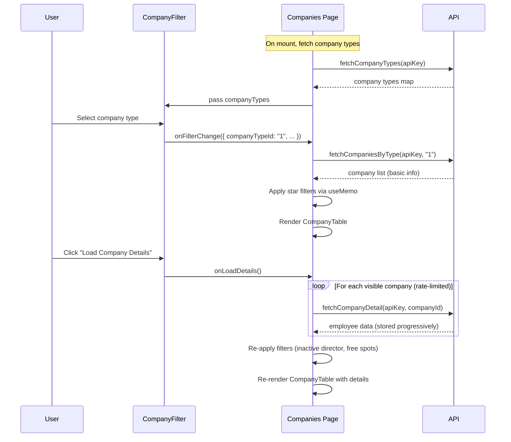

# Companies Page — Design Spec

## Overview

A new page listing Torn companies by type, with filters for stars and employee activity. Company detail (employee-level data) is loaded on demand via a button.

## API Endpoints

### 1. Company Types
- **URL**: `https://api.torn.com/torn/?selections=companies&key={API_KEY}`
- **Cache**: 24 hours, key `torn-company-types`
- **Response shape**:
```json
{
  "companies": {
    "1": {
      "name": "Hair Salon",
      "cost": 750000,
      "default_employees": 4,
      "positions": { ... }
    },
    ...
  }
}
```

### 2. Companies by Type
- **URL**: `https://api.torn.com/company/{TYPE_ID}?selections=companies&key={API_KEY}`
- **Cache**: 1 hour (3,600,000ms), key `torn-companies-type-{TYPE_ID}`
- **Response shape**:
```json
{
  "company": {
    "{COMPANY_ID}": {
      "ID": 90730,
      "company_type": 1,
      "rating": 10,
      "name": "Company Name",
      "director": 3145117,
      "employees_hired": 10,
      "employees_capacity": 10,
      "daily_income": 1534560,
      "daily_customers": 10897,
      "weekly_income": 11029050,
      "weekly_customers": 84499,
      "days_old": 1786
    }
  }
}
```

### 3. Company Detail (employees)
- **URL**: `https://api.torn.com/company/{COMPANY_ID}?selections=&key={API_KEY}`
- **Note**: The empty `selections=` parameter returns the default response which includes employee data. This has been verified against the live API.
- **Cache**: 1 hour (3,600,000ms), key `torn-company-detail-{COMPANY_ID}`
- **Response shape** (adds `employees` map to the company object):
```json
{
  "company": {
    "ID": 90730,
    "employees": {
      "{USER_ID}": {
        "name": "PlayerName",
        "position": "Director",
        "days_in_company": 206,
        "last_action": {
          "status": "Offline",
          "timestamp": 1774763131,
          "relative": "7 hours ago"
        },
        "status": { "state": "Okay", ... }
      }
    }
  }
}
```

**Important**: `last_action.timestamp` is a Unix timestamp in **seconds** (not milliseconds).

All API calls must be wrapped in `httpWrapper`.

### httpWrapper & Caching Strategy

- **Retry**: all endpoints use `{ maxRetries: 2, isSuccess: (r) => r.error === null }`
- **Rate limiter**: `fetchCompanyDetail` calls share a single `RateLimiter` instance (defined at module level) to prevent API bans when loading details for many companies in sequence
- **Dynamic cache keys**: for `fetchCompaniesByType` and `fetchCompanyDetail`, construct a new `Cache` instance **inside the function body** using the dynamic ID in the storage key. The company types endpoint uses a module-level `Cache` since its key is static.

```typescript
// Example: dynamic cache inside function
export async function fetchCompaniesByType(apiKey: string, typeId: string) {
  const cache = new Cache<CompaniesResponse>({
    storageKey: `torn-companies-type-${typeId}`,
    maxStalenessMs: 3_600_000,
  });
  return httpWrapper(
    { cache, retry: { maxRetries: 2, isSuccess: (r) => r.error === null } },
    async () => { /* fetch logic */ }
  );
}
```

| Data | Cache Key | TTL | Rate Limiter |
|---|---|---|---|
| Company types | `torn-company-types` | 24 hours | None (single call) |
| Companies by type | `torn-companies-type-{typeId}` | 1 hour | None (single call per type change) |
| Company detail | `torn-company-detail-{companyId}` | 1 hour | Shared module-level RateLimiter |

## Component Architecture



### File Structure

```
src/
├── api/company/
│   ├── companyTypes.ts       # fetchCompanyTypes()
│   └── companies.ts          # fetchCompaniesByType(), fetchCompanyDetail()
├── components/company/
│   ├── CompanyFilter.tsx      # Collapsible filter panel
│   ├── CompanyFilter.css
│   ├── CompanyTable.tsx       # Table with headers
│   ├── CompanyTable.css
│   ├── CompanyTableRow.tsx    # Single table row
│   └── CompanyTableRow.css
├── pages/
│   ├── Companies.tsx          # Page orchestrator
│   ├── Companies.css          # Page styles
│   └── CompanyEmployees.tsx   # TODO placeholder page
```

Update barrel exports:
- Add company components to `src/components/index.ts`
- Add company API functions to `src/api/index.ts`

## Components

### CompanyFilter

Collapsible panel (same chevron pattern as BountiesFilter, but using CSS classes per CLAUDE.md convention — not inline styles) containing:

1. **Company type dropdown** — populated from `fetchCompanyTypes()`. Selecting a type triggers the parent to fetch companies of that type.
2. **Min stars** — number input (0-10)
3. **Max stars** — number input (0-10)
4. **Exclude inactive director** — checkbox
5. **Count inactive employee as free spot** — checkbox
6. **Days inactivity** — number input (default: 3). Used for both director and employee inactivity filters.
7. **Load Company Details** button — at the bottom of the filter section. Triggers parent to fetch detail for all currently visible (post-filter) companies.

**Props**:
```typescript
interface CompanyFilterProps {
  companyTypes: Record<string, { name: string }>;
  filters: CompanyFilterCriteria;
  onFilterChange: (filters: CompanyFilterCriteria) => void;
  onLoadDetails: () => void;
  detailsLoading: boolean;
}

interface CompanyFilterCriteria {
  companyTypeId: string | null;
  minStars: number | null;
  maxStars: number | null;
  excludeInactiveDirector: boolean;
  countInactiveAsFreeSpot: boolean;
  daysInactivity: number;
}
```

### CompanyTable

Renders `<table>` with headers: Name, Employees, Stars (v1 column set — additional columns out of scope). Maps over companies array and renders `CompanyTableRow` for each.

**Props**:
```typescript
interface CompanyTableProps {
  companies: CompanyBasic[];
  companyDetails: Record<number, CompanyDetail>;
  filters: CompanyFilterCriteria;
}
```

### CompanyTableRow

Renders a single `<tr>`. Receives basic company info and optional detail.

- **Name**: links to `https://www.torn.com/joblist.php#!p=corpinfo&ID={COMPANY_ID}`
- **Employees**: shows `{hired}/{capacity}`. If detail is loaded and "count inactive as free spot" is on, subtracts inactive employees from the hired count. Links to the employee list TODO page (`#/companies/{COMPANY_ID}/employees`).
- **Stars**: shows `rating` value (number of stars)

When detail is not loaded, employee-activity-dependent values show "?" where applicable.

**Props**:
```typescript
interface CompanyTableRowProps {
  company: CompanyBasic;
  detail?: CompanyDetail;
  filters: CompanyFilterCriteria;
}
```

### CompanyEmployees (TODO page)

Placeholder page at route `/companies/:companyId/employees` that displays "Employee list — coming soon".

## Page State (Companies.tsx)

```typescript
// State managed in Companies.tsx
const [companyTypes, setCompanyTypes] = useState<Record<string, { name: string }>>({});
const [typesLoading, setTypesLoading] = useState(true);
const [typesError, setTypesError] = useState<string | null>(null);
const [companies, setCompanies] = useState<CompanyBasic[]>([]);
const [companiesLoading, setCompaniesLoading] = useState(false);
const [companyDetails, setCompanyDetails] = useState<Record<number, CompanyDetail>>({});
const [detailsLoading, setDetailsLoading] = useState(false);
const [filters, setFilters] = useState<CompanyFilterCriteria>({ ... });
```

`detailsLoading` is set to `true` when the load starts and `false` after **all** detail promises resolve (via `Promise.allSettled`). Details are stored incrementally as each promise resolves so the table updates progressively.

If the user changes the company type while details are loading, the in-flight requests are NOT cancelled (the results are simply discarded if the type has changed by the time they resolve).

## Data Flow



## Filtering Logic

All filtering is client-side in `Companies.tsx` via `useMemo`:

1. **Stars**: filter out companies where `rating < minStars` or `rating > maxStars`
2. **Exclude inactive director** (requires detail): find the employee with `position === "Director"`. If `(Date.now() - last_action.timestamp * 1000) / 86_400_000 > daysInactivity`, exclude the company.
3. **Count inactive as free spot** (requires detail): for display purposes, count employees where `(Date.now() - last_action.timestamp * 1000) / 86_400_000 > daysInactivity` and subtract from `employees_hired` in the display.

Filters 2 and 3 only apply when company detail has been loaded. Without detail, those filters are no-ops.

## Routing

- Add `/companies` route in `App.tsx` pointing to `Companies` page
- Add `/companies/:companyId/employees` route pointing to `CompanyEmployees` placeholder
- Add "Companies" entry in `Menu.tsx`

## Type Definitions

```typescript
// Basic company from the list endpoint
interface CompanyBasic {
  ID: number;
  company_type: number;
  rating: number;
  name: string;
  director: number;
  employees_hired: number;
  employees_capacity: number;
  daily_income: number;
  daily_customers: number;
  weekly_income: number;
  weekly_customers: number;
  days_old: number;
}

// Employee from the detail endpoint
interface CompanyEmployee {
  name: string;
  position: string;
  days_in_company: number;
  last_action: {
    status: string;
    timestamp: number;  // Unix timestamp in SECONDS
    relative: string;
  };
  status: {
    description: string;
    details: string;
    state: string;
    color: string;
    until: number;
  };
}

// Detail response — extends CompanyBasic with employee data
interface CompanyDetail extends CompanyBasic {
  employees: Record<string, CompanyEmployee>;
}
```
