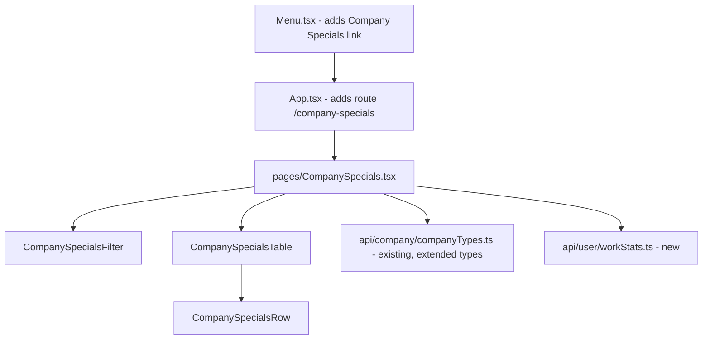
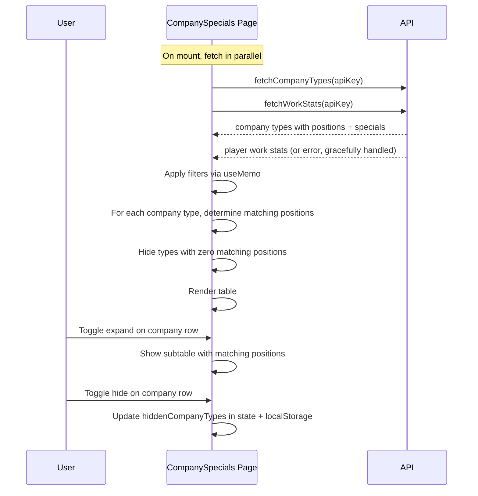

# Company Specials Page — Design Spec

## Overview

A page listing all Torn company types with their specials (unlocked at star ratings 1, 3, 5, 7, 10) in a table. Each company type row is expandable to show matching positions. Filters allow narrowing by position stat gains and player work stat coverage.

## API Endpoints

### 1. Company Types (existing, needs type extension)
- **URL**: `https://api.torn.com/torn/?selections=companies&key={API_KEY}`
- **Module**: `src/api/company/companyTypes.ts` — `fetchCompanyTypes()`
- **Cache**: 24 hours (already implemented)
- **Note**: The existing `CompanyTypeInfo` interface only has `name`, `cost`, `default_employees`. It must be extended with `positions` and `specials` fields (see Type Definitions below). The API already returns these fields — they were simply not typed.

### 2. Work Stats (new)
- **URL**: `https://api.torn.com/user/?selections=workstats&key={API_KEY}`
- **Cache**: 2 hours (7,200,000ms), key `torn-user-workstats`
- **Response shape**:
```json
{
  "manual_labor": 7727,
  "intelligence": 12345,
  "endurance": 15214
}
```

All API calls must be wrapped in `httpWrapper`.

## Component Architecture



### File Structure

```
src/
├── api/user/
│   └── workStats.ts                        # fetchWorkStats() — NEW
├── components/company-specials/
│   ├── types.ts                            # CompanySpecialsFilterCriteria, helpers
│   ├── CompanySpecialsFilter.tsx            # Collapsible filter panel
│   ├── CompanySpecialsFilter.css
│   ├── CompanySpecialsTable.tsx             # Main table
│   ├── CompanySpecialsTable.css
│   ├── CompanySpecialsRow.tsx               # Company type row + expandable subtable
│   └── CompanySpecialsRow.css
├── pages/
│   ├── CompanySpecials.tsx                  # Page orchestrator
│   └── CompanySpecials.css
```

Update barrel exports:
- Add workStats to `src/api/index.ts`
- Add company specials components to `src/components/index.ts`

## Type Definitions

### Extending CompanyTypeInfo (modify `src/api/company/companyTypes.ts`)

```typescript
export interface CompanyPosition {
  man_required: number;
  int_required: number;
  end_required: number;
  man_gain: number;
  int_gain: number;
  end_gain: number;
  special_ability: string;
  description: string;
}

export interface CompanySpecial {
  effect: string;
  cost: number;
  rating_required: number;
}

export interface CompanyTypeInfo {
  name: string;
  cost: number;
  default_employees: number;
  positions: Record<string, CompanyPosition>;
  specials: Record<string, CompanySpecial>;
}
```

### Work Stats

```typescript
export interface WorkStats {
  manual_labor: number;
  intelligence: number;
  endurance: number;
}
```

### Filter Criteria (in `src/components/company-specials/types.ts`)

```typescript
type StatType = 'man' | 'int' | 'end';

interface CompanySpecialsFilterCriteria {
  primaryGain: StatType[];        // multi-select, default all 3
  secondaryGain: StatType[];      // multi-select, default all 3
  minStatPercentMan: number | null;  // min % of man_required met by player
  minStatPercentInt: number | null;  // min % of int_required met by player
  minStatPercentEnd: number | null;  // min % of end_required met by player
  showHidden: boolean;            // show manually hidden companies
}

const defaultSpecialsFilters: CompanySpecialsFilterCriteria = {
  primaryGain: ['man', 'int', 'end'],
  secondaryGain: ['man', 'int', 'end'],
  minStatPercentMan: null,
  minStatPercentInt: null,
  minStatPercentEnd: null,
  showHidden: false,
};
```

## Special Data Structure

The `specials` field from the company types API:
```json
{
  "Debate": {
    "effect": "Experience",
    "cost": 1,
    "rating_required": 1
  }
}
```

- `cost: 0` = passive (always active) → display "Passive"
- `cost: > 0` = costs that many job points → display "{cost} JP"
- `rating_required`: one of 1, 3, 5, 7, 10 (some company types have fewer than 5 specials — missing rating levels show as empty cells)

## Components

### CompanySpecialsFilter

Collapsible panel (same chevron pattern as other filters) containing:

1. **Primary gain** — 3 checkboxes (MAN, INT, END), all checked by default.
2. **Secondary gain** — 3 checkboxes (MAN, INT, END), all checked by default.
3. **Min stat % fulfilled** — 3 number inputs (MAN, INT, END). For each position, check: if `required > 0`, does `player_stat / required * 100 >= threshold`? If `required == 0`, that stat is auto-pass.
4. **Show hidden companies** — checkbox toggle

**Props**:
```typescript
interface CompanySpecialsFilterProps {
  filters: CompanySpecialsFilterCriteria;
  onFilterChange: (filters: CompanySpecialsFilterCriteria) => void;
}
```

### CompanySpecialsTable

Renders `<table>` with headers:
| Company Type | ★ 1 | ★ 3 | ★ 5 | ★ 7 | ★ 10 | Hide |

Maps over company types and renders `CompanySpecialsRow` for each.

**Props**:
```typescript
interface CompanySpecialsTableProps {
  companyTypes: Record<string, CompanyTypeInfo>;
  hiddenCompanyTypes: string[];
  onToggleHidden: (typeId: string) => void;
  filters: CompanySpecialsFilterCriteria;
  workStats: WorkStats | null;
}
```

### CompanySpecialsRow

Renders two `<tr>` elements:

**First `<tr>`** — the company type summary row:
1. **Company Type cell**: company name + clickable chevron to expand/collapse
2. **Special cells (5)**: one per rating level (1, 3, 5, 7, 10). Each cell shows 3 lines:
   - Line 1: **Name** (bold)
   - Line 2: Effect text
   - Line 3: "Passive" if cost == 0, or "{cost} JP" if cost > 0
   - Empty cell if no special at that rating level
3. **Hide toggle**: button to toggle the company type's hidden state

**Second `<tr>`** (only when expanded) — contains a single `<td colSpan={7}>` wrapping the positions subtable. This ensures valid HTML table structure. The subtable columns:
- Position, Man Required, Int Required, End Required, Man Gain, Int Gain, End Gain, Special Ability, Description

**Props**:
```typescript
interface CompanySpecialsRowProps {
  typeId: string;
  companyType: CompanyTypeInfo;
  matchingPositions: [string, CompanyPosition][];
  isHidden: boolean;
  onToggleHidden: () => void;
}
```

## Filtering Logic

All filtering is client-side in `CompanySpecials.tsx` via `useMemo`:

### Determining Primary and Secondary Gain

For each position, rank its three gain values (`man_gain`, `int_gain`, `end_gain`) from highest to lowest:
- **Primary gain** = the stat type with the highest gain value
- **Secondary gain** = the stat type with the second-highest gain value
- **Tie-breaking rule**: when two or more gains are equal, use alphabetical order: `end` < `int` < `man`. So if `man_gain == int_gain > end_gain`, primary = `man`, secondary = `int`.
- **All-zero positions** (all three gains are 0): these positions always pass the primary/secondary gain filters (they are never filtered out by gain type). They can still be filtered out by stat % thresholds.

### Position Matching

A position matches filters if ALL of:

1. **Primary gain match**: position's primary gain stat type is in `filters.primaryGain` (or all gains are 0 — auto-pass).
2. **Secondary gain match**: position's secondary gain stat type is in `filters.secondaryGain` (or all gains are 0 — auto-pass).
3. **Stat % threshold** (only if workStats loaded and threshold is set): for each stat (man, int, end), if the corresponding min threshold is not null and `required > 0`, then `playerStat / required * 100 >= threshold`. If `required == 0` or threshold is null, that stat auto-passes.

### Company Type Visibility

- If **no positions** match the filters → hide the entire company type row
- If **some positions** match → show the row; expanded subtable only shows matching positions
- If company type is in `hiddenCompanyTypes` → hide unless `showHidden` is true (shown with reduced opacity)

## Hidden Companies

- Stored in localStorage as `company-specials-hidden` (JSON array of type ID strings)
- Toggle via a button in each row
- When `showHidden` is true in filters, hidden companies appear with reduced opacity

## Persistence

All filter preferences stored in localStorage under `company-specials-filters` (same pattern as Companies page). Hidden company types stored separately under `company-specials-hidden`.

## Routing

- Add `/company-specials` route in `App.tsx`
- Add "Company Specials" entry in `Menu.tsx`

## Page State (CompanySpecials.tsx)

```typescript
const [companyTypes, setCompanyTypes] = useState<CompanyTypesResponse['companies']>({});
const [typesLoading, setTypesLoading] = useState(true);
const [typesError, setTypesError] = useState<string | null>(null);
const [workStats, setWorkStats] = useState<WorkStats | null>(null);
const [workStatsLoading, setWorkStatsLoading] = useState(true);
const [workStatsError, setWorkStatsError] = useState<string | null>(null);
const [filters, setFilters] = useState<CompanySpecialsFilterCriteria>(getInitialFilters);
const [hiddenCompanyTypes, setHiddenCompanyTypes] = useState<string[]>(getInitialHidden);
```

**Error handling**: if `workStats` fails to load, toast the error and continue — the page is still usable. Stat % filters simply have no effect when `workStats` is null. If company types fail to load, show an error message (same pattern as Companies page). If API key is missing, show "Please set your Torn API key in Settings."

## Data Flow


